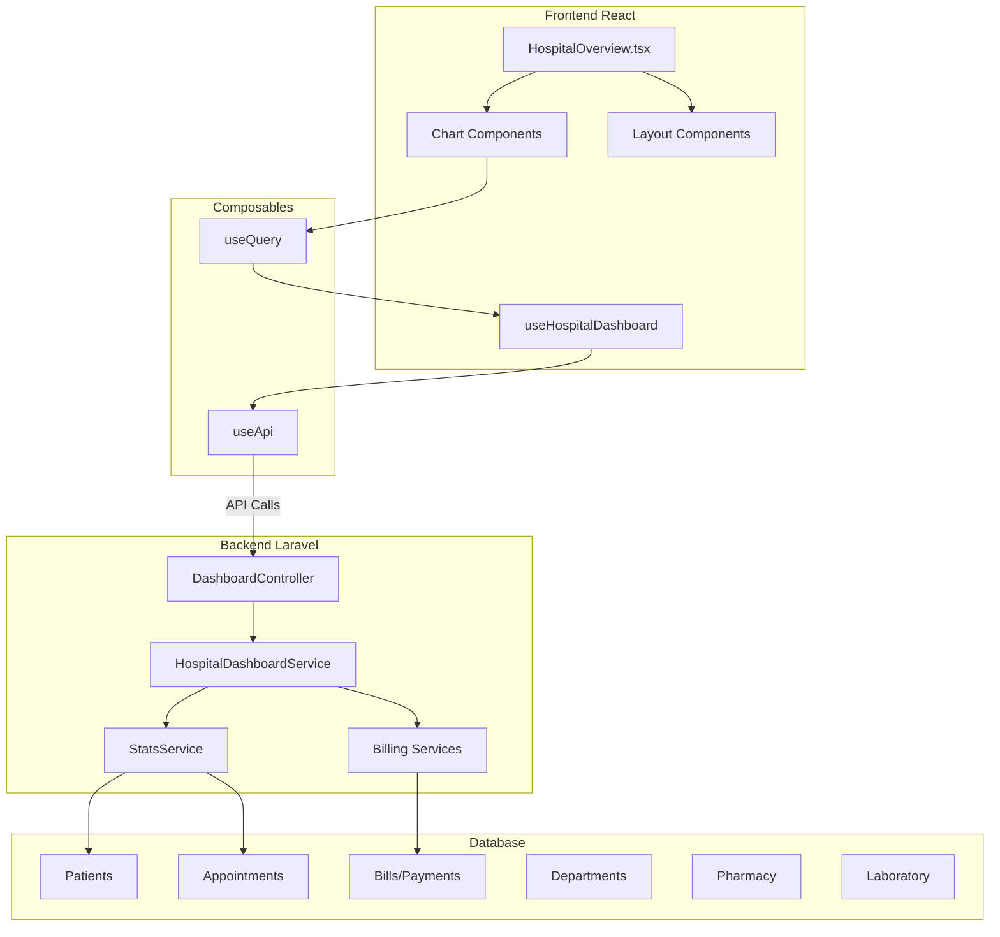

# Hospital Overview Dashboard - Implementation Plan

## Overview

This document outlines the implementation plan for a comprehensive Hospital Overview Dashboard focusing on **Financial & Operational** metrics with a 5-minute refresh interval.

## Architecture Diagram



## Implementation Phases

### Phase 1: Backend Service & API

#### File: `app/Services/HospitalDashboardService.php`

```php
<?php

namespace App\Services;

use App\Models\Patient;
use App\Models\Appointment;
use App\Models\Bill;
use App\Models\Payment;
use App\Models\Department;
use App\Models\Medicine;
use App\Models\Sale;
use App\Models\LabTestRequest;
use Carbon\Carbon;
use Illuminate\Support\Facades\DB;

class HospitalDashboardService extends BaseService
{
    protected StatsService $statsService;
    
    public function __construct(StatsService $statsService)
    {
        $this->statsService = $statsService;
    }
    
    /**
     * Get summary KPIs for header section
     */
    public function getSummary(array $dateRange = []): array
    {
        $today = Carbon::today();
        $startOfDay = $today->startOfDay();
        $endOfDay = $today->endOfDay();
        
        return [
            'totalActivePatients' => Patient::count(),
            'todayAppointments' => Appointment::whereBetween('appointment_date', [$startOfDay, $endOfDay])->count(),
            'completedAppointments' => Appointment::whereBetween('appointment_date', [$startOfDay, $endOfDay])
                ->where('status', 'completed')->count(),
            'todayRevenue' => Payment::whereDate('created_at', $today)->where('status', 'completed')->sum('amount'),
            'monthlyRevenue' => Payment::whereMonth('created_at', Carbon::now()->month)
                ->whereYear('created_at', Carbon::now()->year)->where('status', 'completed')->sum('amount'),
            'outstandingBills' => Bill::where('status', 'pending')->sum('total_amount'),
            'outstanding30Days' => Bill::where('status', 'pending')
                ->where('created_at', '>=', Carbon::now()->subDays(30))->sum('total_amount'),
            'outstanding60Days' => Bill::where('status', 'pending')
                ->whereBetween('created_at', [Carbon::now()->subDays(60), Carbon::now()->subDays(30)])->sum('total_amount'),
            'outstanding90PlusDays' => Bill::where('status', 'pending')
                ->where('created_at', '<', Carbon::now()->subDays(90))->sum('total_amount'),
        ];
    }
    
    /**
     * Get financial metrics
     */
    public function getFinancialMetrics(string $period = 'month'): array
    {
        $revenueTrend = $this->getRevenueTrend($period);
        $paymentMethods = $this->getPaymentMethodDistribution();
        $agingAnalysis = $this->getAgingAnalysis();
        
        return [
            'revenueTrend' => $revenueTrend,
            'paymentMethods' => $paymentMethods,
            'agingAnalysis' => $agingAnalysis,
            'departmentRevenue' => $this->getDepartmentRevenue(),
            'dailyStats' => $this->statsService->getDailyPatientStats(),
        ];
    }
    
    /**
     * Get operational metrics
     */
    public function getOperationalMetrics(): array
    {
        return [
            'departmentWorkload' => $this->getDepartmentWorkload(),
            'doctorUtilization' => $this->getDoctorUtilization(),
            'appointmentStats' => $this->getAppointmentStats(),
            'averageWaitTimes' => $this->getAverageWaitTimes(),
        ];
    }
    
    /**
     * Get patient flow metrics
     */
    public function getPatientFlowMetrics(): array
    {
        return [
            'todayRegistrations' => Patient::whereDate('created_at', Carbon::today())->count(),
            'weeklyRegistrations' => Patient::whereBetween('created_at', [
                Carbon::now()->startOfWeek(), Carbon::now()->endOfWeek()
            ])->count(),
            'demographics' => $this->getPatientDemographics(),
            'departmentDistribution' => $this->getDepartmentPatientDistribution(),
        ];
    }
    
    // Helper methods implementation...
}
```

#### File: `app/Http/Controllers/Dashboard/HospitalDashboardController.php`

```php
<?php

namespace App\Http\Controllers\Dashboard;

use App\Http\Controllers\Controller;
use App\Services\HospitalDashboardService;
use Illuminate\Http\Request;
use Illuminate\Support\Facades\Auth;

class HospitalDashboardController extends Controller
{
    protected HospitalDashboardService $dashboardService;
    
    public function __construct(HospitalDashboardService $dashboardService)
    {
        $this->dashboardService = $dashboardService;
        $this->middleware('auth:sanctum');
    }
    
    /**
     * Get dashboard summary
     */
    public function summary(Request $request)
    {
        if (!Auth::user()->hasPermission('view-dashboard')) {
            return response()->json(['error' => 'Unauthorized'], 403);
        }
        
        $dateRange = $request->only(['from', 'to']);
        $data = $this->dashboardService->getSummary($dateRange);
        
        return response()->json($data);
    }
    
    /**
     * Get financial metrics
     */
    public function financial(Request $request)
    {
        if (!Auth::user()->hasPermission('view-dashboard')) {
            return response()->json(['error' => 'Unauthorized'], 403);
        }
        
        $period = $request->get('period', 'month');
        $data = $this->dashboardService->getFinancialMetrics($period);
        
        return response()->json($data);
    }
    
    /**
     * Get operational metrics
     */
    public function operational(Request $request)
    {
        if (!Auth::user()->hasPermission('view-dashboard')) {
            return response()->json(['error' => 'Unauthorized'], 403);
        }
        
        $data = $this->dashboardService->getOperationalMetrics();
        
        return response()->json($data);
    }
    
    /**
     * Get patient flow metrics
     */
    public function patientFlow(Request $request)
    {
        if (!Auth::user()->hasPermission('view-dashboard')) {
            return response()->json(['error' => 'Unauthorized'], 403);
        }
        
        $data = $this->dashboardService->getPatientFlowMetrics();
        
        return response()->json($data);
    }
}
```

### Phase 2: TypeScript Types

#### File: `resources/js/types/dashboard.ts`

```typescript
export interface HospitalSummary {
    totalActivePatients: number;
    todayAppointments: number;
    completedAppointments: number;
    todayRevenue: number;
    monthlyRevenue: number;
    outstandingBills: number;
    outstanding30Days: number;
    outstanding60Days: number;
    outstanding90PlusDays: number;
}

export interface FinancialMetrics {
    revenueTrend: RevenueTrendData[];
    paymentMethods: PaymentMethodData[];
    agingAnalysis: AgingData[];
    departmentRevenue: DepartmentRevenueData[];
    dailyStats: DailyStats;
}

export interface RevenueTrendData {
    date: string;
    revenue: number;
    expenses?: number;
}

export interface PaymentMethodData {
    method: string;
    amount: number;
    percentage: number;
}

export interface AgingData {
    range: string;
    amount: number;
    count: number;
}

export interface DepartmentRevenueData {
    department: string;
    revenue: number;
    percentage: number;
}

export interface OperationalMetrics {
    departmentWorkload: DepartmentWorkloadData[];
    doctorUtilization: DoctorUtilizationData[];
    appointmentStats: AppointmentStats;
    averageWaitTimes: WaitTimeData[];
}

export interface DepartmentWorkloadData {
    department: string;
    patients: number;
    appointments: number;
    utilization: number;
}

export interface PatientFlowMetrics {
    todayRegistrations: number;
    weeklyRegistrations: number;
    demographics: DemographicsData[];
    departmentDistribution: DepartmentDistributionData[];
}

export interface DemographicsData {
    ageGroup: string;
    count: number;
    percentage: number;
}

export interface DepartmentDistributionData {
    department: string;
    patients: number;
    percentage: number;
}

export type DashboardData = {
    summary: HospitalSummary;
    financial: FinancialMetrics;
    operational: OperationalMetrics;
    patientFlow: PatientFlowMetrics;
    lastUpdated: string;
};
```

### Phase 3: Frontend Composables

#### File: `resources/js/composables/useHospitalDashboard.ts`

```typescript
import { useQuery } from '@tanstack/react-query';
import { useApi } from './useApi';
import type { HospitalSummary, FinancialMetrics, OperationalMetrics, PatientFlowMetrics } from '@/types/dashboard';

const REFRESH_INTERVAL = 5 * 60 * 1000; // 5 minutes

export function useHospitalDashboard(dateRange?: { from: string; to: string }) {
    const api = useApi();
    
    const summary = useQuery({
        queryKey: ['dashboard', 'summary', dateRange],
        queryFn: () => api.get<HospitalSummary>('/v1/dashboard/summary', dateRange),
        refetchInterval: REFRESH_INTERVAL,
    });
    
    const financial = useQuery({
        queryKey: ['dashboard', 'financial'],
        queryFn: () => api.get<FinancialMetrics>('/v1/dashboard/financial'),
        refetchInterval: REFRESH_INTERVAL,
    });
    
    const operational = useQuery({
        queryKey: ['dashboard', 'operational'],
        queryFn: () => api.get<OperationalMetrics>('/v1/dashboard/operational'),
        refetchInterval: REFRESH_INTERVAL,
    });
    
    const patientFlow = useQuery({
        queryKey: ['dashboard', 'patient-flow'],
        queryFn: () => api.get<PatientFlowMetrics>('/v1/dashboard/patient-flow'),
        refetchInterval: REFRESH_INTERVAL,
    });
    
    return {
        summary,
        financial,
        operational,
        patientFlow,
        isLoading: summary.isLoading || financial.isLoading || operational.isLoading || patientFlow.isLoading,
        isError: summary.isError || financial.isError || operational.isError || patientFlow.isError,
    };
}
```

### Phase 4: Chart Components

#### File: `resources/js/Components/ui/StatCard.tsx`

```typescript
import { Card, CardContent } from './card';
import { cn } from '@/lib/utils';
import { LucideIcon, TrendingUp, TrendingDown } from 'lucide-react';

interface StatCardProps {
    title: string;
    value: string | number;
    icon: LucideIcon;
    trend?: {
        value: number;
        isPositive: boolean;
    };
    format?: 'currency' | 'number' | 'percent';
    className?: string;
}

export function StatCard({ title, value, icon: Icon, trend, format = 'number', className }: StatCardProps) {
    const formatValue = (val: string | number) => {
        if (format === 'currency') {
            return new Intl.NumberFormat('en-US', { style: 'currency', currency: 'USD' }).format(Number(val));
        }
        if (format === 'percent') {
            return `${val}%`;
        }
        return new Intl.NumberFormat('en-US').format(Number(val));
    };
    
    return (
        <Card className={cn('overflow-hidden', className)}>
            <CardContent className="p-6">
                <div className="flex items-center justify-between">
                    <div className="space-y-2">
                        <p className="text-sm font-medium text-muted-foreground">{title}</p>
                        <p className="text-3xl font-bold tracking-tight">{formatValue(value)}</p>
                        {trend && (
                            <div className={cn(
                                'flex items-center gap-1 text-sm',
                                trend.isPositive ? 'text-green-600' : 'text-red-600'
                            )}>
                                {trend.isPositive ? <TrendingUp className="h-4 w-4" /> : <TrendingDown className="h-4 w-4" />}
                                <span>{Math.abs(trend.value)}%</span>
                            </div>
                        )}
                    </div>
                    <div className="rounded-full bg-primary/10 p-3">
                        <Icon className="h-6 w-6 text-primary" />
                    </div>
                </div>
            </CardContent>
        </Card>
    );
}
```

### Phase 5: Dashboard Page

#### File: `resources/js/Pages/HospitalOverview.tsx`

```typescript
import { Head } from '@inertiajs/react';
import HospitalLayout from '@/layouts/HospitalLayout';
import { StatCard } from '@/components/ui/StatCard';
import { DonutChart, LineChart, BarChart } from '@/components/ui/charts';
import { useHospitalDashboard } from '@/composables/useHospitalDashboard';
import { Card, CardContent, CardHeader, CardTitle } from '@/components/ui/card';
import { Select, SelectContent, SelectItem, SelectTrigger, SelectValue } from '@/components/ui/select';
import { RefreshCw } from 'lucide-react';
import { useState } from 'react';

export default function HospitalOverview() {
    const [timeRange, setTimeRange] = useState('month');
    const { summary, financial, operational, patientFlow, isLoading } = useHospitalDashboard();
    
    return (
        <HospitalLayout>
            <Head title="Hospital Overview Dashboard" />
            
            <div className="space-y-6 p-6">
                {/* Header */}
                <div className="flex items-center justify-between">
                    <div>
                        <h1 className="text-3xl font-bold tracking-tight">Hospital Overview</h1>
                        <p className="text-muted-foreground">Real-time insights into hospital operations</p>
                    </div>
                    <div className="flex items-center gap-4">
                        <Select value={timeRange} onValueChange={setTimeRange}>
                            <SelectTrigger className="w-[180px]">
                                <SelectValue placeholder="Select period" />
                            </SelectTrigger>
                            <SelectContent>
                                <SelectItem value="today">Today</SelectItem>
                                <SelectItem value="week">This Week</SelectItem>
                                <SelectItem value="month">This Month</SelectItem>
                                <SelectItem value="year">This Year</SelectItem>
                            </SelectContent>
                        </Select>
                        <RefreshCw className="h-4 w-4 text-muted-foreground" />
                        <span className="text-sm text-muted-foreground">Updates every 5 minutes</span>
                    </div>
                </div>
                
                {/* KPI Summary Cards */}
                <div className="grid gap-4 md:grid-cols-2 lg:grid-cols-4">
                    <StatCard
                        title="Total Active Patients"
                        value={summary.data?.totalActivePatients ?? 0}
                        icon="Users"
                        trend={{ value: 12, isPositive: true }}
                    />
                    <StatCard
                        title="Today's Appointments"
                        value={`${summary.data?.completedAppointments ?? 0}/${summary.data?.todayAppointments ?? 0}`}
                        icon="Calendar"
                    />
                    <StatCard
                        title="Today's Revenue"
                        value={summary.data?.todayRevenue ?? 0}
                        icon="DollarSign"
                        format="currency"
                        trend={{ value: 8, isPositive: true }}
                    />
                    <StatCard
                        title="Outstanding Bills"
                        value={summary.data?.outstandingBills ?? 0}
                        icon="CreditCard"
                        format="currency"
                    />
                </div>
                
                {/* Main Grid */}
                <div className="grid gap-6 lg:grid-cols-3">
                    {/* Left Column - Patient Flow */}
                    <div className="space-y-6 lg:col-span-1">
                        <Card>
                            <CardHeader>
                                <CardTitle>Patient Flow</CardTitle>
                            </CardHeader>
                            <CardContent>
                                <DonutChart
                                    data={patientFlow.data?.demographics}
                                    dataKey="count"
                                    nameKey="ageGroup"
                                />
                            </CardContent>
                        </Card>
                        
                        <Card>
                            <CardHeader>
                                <CardTitle>Department Distribution</CardTitle>
                            </CardHeader>
                            <CardContent>
                                <BarChart
                                    data={patientFlow.data?.departmentDistribution}
                                    dataKey="patients"
                                    nameKey="department"
                                />
                            </CardContent>
                        </Card>
                    </div>
                    
                    {/* Center Column - Financial & Operational */}
                    <div className="space-y-6 lg:col-span-1">
                        <Card>
                            <CardHeader>
                                <CardTitle>Revenue Trend</CardTitle>
                            </CardHeader>
                            <CardContent>
                                <LineChart
                                    data={financial.data?.revenueTrend}
                                    dataKey="revenue"
                                    nameKey="date"
                                />
                            </CardContent>
                        </Card>
                        
                        <Card>
                            <CardHeader>
                                <CardTitle>Department Workload</CardTitle>
                            </CardHeader>
                            <CardContent>
                                <BarChart
                                    data={operational.data?.departmentWorkload}
                                    dataKey="utilization"
                                    nameKey="department"
                                />
                            </CardContent>
                        </Card>
                    </div>
                    
                    {/* Right Column - Additional Metrics */}
                    <div className="space-y-6 lg:col-span-1">
                        <Card>
                            <CardHeader>
                                <CardTitle>Payment Methods</CardTitle>
                            </CardHeader>
                            <CardContent>
                                <DonutChart
                                    data={financial.data?.paymentMethods}
                                    dataKey="amount"
                                    nameKey="method"
                                />
                            </CardContent>
                        </Card>
                        
                        <Card>
                            <CardHeader>
                                <CardTitle>Billing Aging</CardTitle>
                            </CardHeader>
                            <CardContent>
                                <BarChart
                                    data={financial.data?.agingAnalysis}
                                    dataKey="amount"
                                    nameKey="range"
                                />
                            </CardContent>
                        </Card>
                    </div>
                </div>
            </div>
        </HospitalLayout>
    );
}
```

## API Routes

```php
// routes/api.php
Route::prefix('v1/dashboard')->middleware('auth:sanctum')->group(function () {
    Route::get('/summary', [HospitalDashboardController::class, 'summary']);
    Route::get('/financial', [HospitalDashboardController::class, 'financial']);
    Route::get('/operational', [HospitalDashboardController::class, 'operational']);
    Route::get('/patient-flow', [HospitalDashboardController::class, 'patientFlow']);
});
```

## Files to Create/Modify

### New Files
1. `app/Services/HospitalDashboardService.php`
2. `app/Http/Controllers/Dashboard/HospitalDashboardController.php`
3. `resources/js/types/dashboard.ts`
4. `resources/js/composables/useHospitalDashboard.ts`
5. `resources/js/Components/ui/StatCard.tsx`
6. `resources/js/Components/ui/charts/DonutChart.tsx`
7. `resources/js/Components/ui/charts/LineChart.tsx`
8. `resources/js/Components/ui/charts/BarChart.tsx`
9. `resources/js/Pages/HospitalOverview.tsx`

### Modified Files
1. `routes/api.php` - Add dashboard routes
2. `resources/js/types/index.ts` - Export dashboard types
3. `resources/js/Components/ui/index.ts` - Export new components
4. `resources/js/routes.ts` - Add hospital overview route
5. `resources/js/layouts/HospitalLayout.tsx` - Add dashboard nav item
